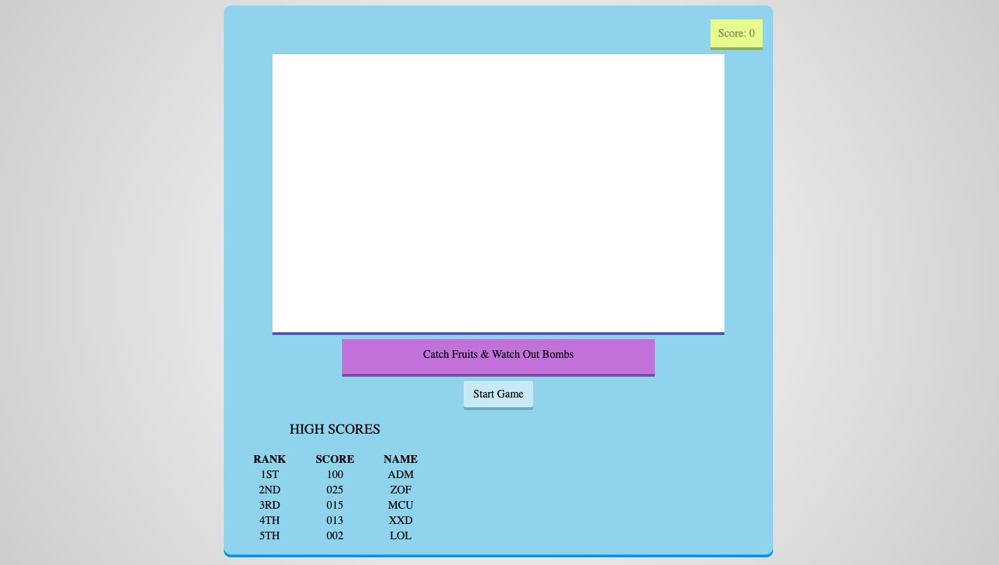
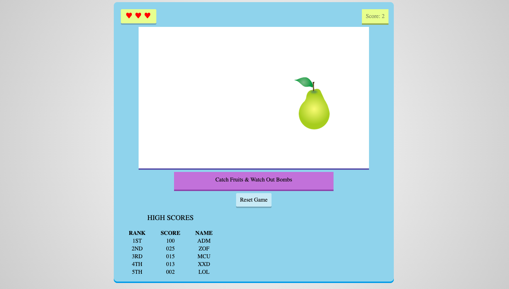
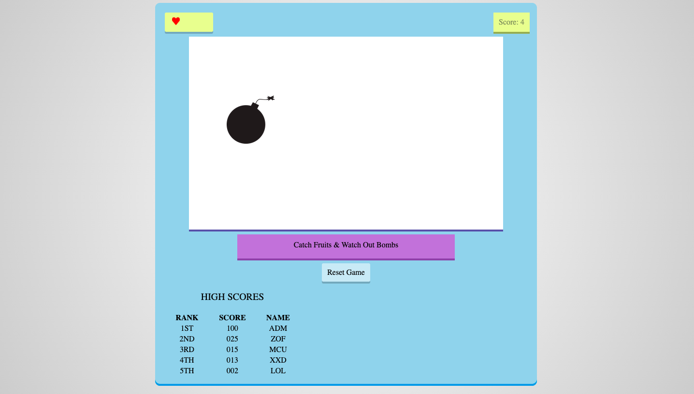

# Fruit Game
> Simple Fruit Game created with JavaScript. To start the game you have to click on "Start Game". The games starts and the goal of the game is to catch the most fruits you can. For each caught fruit you gain one point. Beware bombs, if you catch one you lose. Also if you miss three fruits you lose! Good luck and have fun!

## Table of contents
- [Fruit Game](#fruit-game)
  - [Table of contents](#table-of-contents)
  - [Try it](#try-it)
  - [Screenshots](#screenshots)
  - [Technologies](#technologies)
  - [Features](#features)
  - [Status](#status)
  - [Inspiration](#inspiration)
  - [Contact](#contact)

## [Try it](https://hacia.students.wmi.amu.edu.pl/projects/3.%20Fruits%20Game%20(JQuery))

## Screenshots

## Technologies
* JavaScript 
* JQuerry
* CSS

## Features
* Catch fruits by slicing it with your mouse
* Avoid bombs, if you slice one then KABOOM
* Sounds efects
* Score Table

## Status
Project is: _completed_

## Inspiration
I wanted to learn some JQuerry and basic JavaScript. And I really liked Fruit Ninja Game when I was a kid :).

## Contact
Created by [@HondaPL](https://hacia.students.wmi.amu.edu.pl/) 2020

